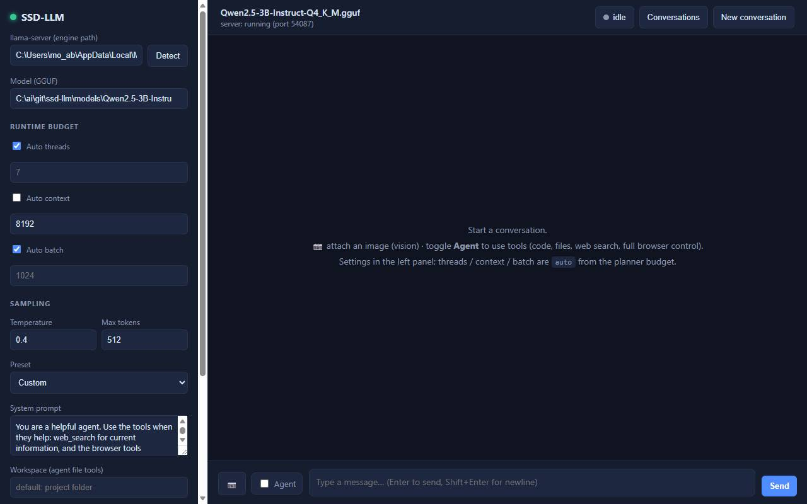

# AnyHardware AI

**Run open GGUF language models on any machine. CPU + RAM + SSD only. No GPU required.**

<div align="center">

[](https://github.com/mahmouddawod-it/AnyHardware-AI)
[](https://opensource.org/licenses/MIT)
[](https://www.python.org/)
[](https://github.com/mahmouddawod-it/AnyHardware-AI/actions)

**If this project helps you, give it a star!** ⭐

</div>

AnyHardware AI (package: `ssd-llm`) is a local, zero-dependency runner for quantized GGUF models.
It uses `llama.cpp` for inference and adds a small decision layer that sizes CPU threads, context and
batch to your machine's real RAM budget, so models run stably on weak, GPU-less machines without
falling into swap.

Instead of loading a huge FP16 model layer-by-layer in Python, it keeps quantized GGUF files on your
SSD and relies on `mmap` page caching: the OS keeps hot pages in RAM and evicts the rest automatically.

## Screenshot



---

## Features

- **No GPU needed** - always runs with `-ngl 0`. Pure CPU inference via `llama.cpp`.
- **Zero Python dependencies** - 100% standard library. No Transformers, no requests, no Playwright,
  no Chromium download.
- **Adaptive safety planner** - inspects available RAM and CPU, reserves OS headroom (20% / min 2 GiB),
  and picks a conservative context/batch/threads budget so the machine never swaps.
- **Web chat UI** - single-file frontend with chat history, per-chat agent mode, model/engine picker,
  live activity status and a stop button.
- **Agent with tools** - the model can call tools:
  - `run_python` - isolated, stdlib-only sandbox (30 s timeout)
  - `read_file` / `write_file` / `list_files` - confined to the configured workspace
  - `web_search` - Bing/DDG search with automatic Arabic locale (`mkt=ar-EG`)
  - `navigate` / `browser_snapshot` / `click_element` / `type_text` / `scroll` / `run_js` /
    `browser_screenshot` / `press_enter` - full browser automation
- **Browser automation without Playwright** - drives an installed Edge/Chrome through CDP using a
  hand-written RFC 6455 WebSocket client. No binaries are downloaded.
- **Bilingual** - Arabic system prompts; works with Arabic and English instructions.
- **Vision support** - auto-detects `mmproj-*.gguf` sidecars for Qwen2.5-VL-style models.
- **Runs anywhere** - works on Windows, Linux and macOS (the planner uses `GlobalMemoryStatusEx` on
  Windows and `sysconf` elsewhere).

---

## Requirements

1. **Python 3.10+**
2. **llama.cpp** with `llama-cli` and `llama-server` binaries. On Windows you can install it with
   `winget install ggml.llamacpp`; otherwise build from source. AnyHardware AI auto-detects
   `llama-server` on your `PATH` or from WinGet packages.
3. **A quantized GGUF model** (Q4_K_M recommended), e.g. Qwen2.5-3B-Instruct-Q4_K_M.gguf.
4. **Microsoft Edge or Google Chrome** (optional - only needed for the browser tools).

---

## One-click setup (Windows)

The repository ships with three helper scripts:

| Script | What it does |
| --- | --- |
| `check-system.bat` | Scans your machine (Python, pip, curl, llama.cpp, Edge/Chrome, CPU, RAM, free disk), reports `[OK]/[WARN]/[FAIL]`, and prints the next steps. |
| `download-models.bat` | Interactive model picker. Reads your free RAM, recommends which models fit, and downloads them with **resume support** into `models/`. |
| `start-web.bat` | Installs/launches the web UI on http://127.0.0.1:8300 (stops any old server first). |

### Setup flow

```bat
1.  double-click  check-system.bat     -> see what is missing
2.  double-click  download-models.bat  -> pick a model that fits your RAM
3.  double-click  start-web.bat        -> open http://127.0.0.1:8300
```

`download-models.bat` lists the official Qwen GGUF models (Qwen2.5 series) and only
recommends the ones your free RAM can handle (models need roughly 2x their file size):

| Choice | File size | Free RAM needed |
| --- | --- | --- |
| Qwen2.5-0.5B-Instruct (Q4_K_M) | 397 MB | ~2 GiB |
| Qwen2.5-1.5B-Instruct (Q4_K_M) | 1.1 GB | ~4 GiB |
| Qwen2.5-3B-Instruct (Q4_K_M) | 2.1 GB | ~6 GiB |
| Qwen2.5-7B-Instruct (Q4_K_M) | 4.7 GB | ~10 GiB |
| Qwen2.5-14B-Instruct (Q4_K_M) | 9.0 GB | ~18 GiB |

Downloads use `curl -C -`: if the connection drops, run the script again and it resumes
where it stopped instead of starting over. Multi-part models (7B and 14B) are fetched
as separate `.gguf` parts; llama.cpp loads them automatically when you point it at the
first part.

---

## Quickstart

### 1. Install

```powershell
cd AnyHardware-AI
py -m pip install -e .
```

### 2. Inspect the machine budget

```powershell
ssd-llm inspect
```

Shows the safe thread / context / batch plan computed from your RAM and CPU.

### 3. Run a model from the CLI

```powershell
ssd-llm run `
  --engine C:\tools\llama.cpp\llama-cli.exe `
  --model  D:\models\Qwen2.5-7B-Instruct-Q4_K_M.gguf `
  --prompt "Explain what an SSD is in two sentences" `
  --tokens 180
```

Manual overrides are available: `--threads`, `--context`, `--batch`.

### 4. Start the web UI

```powershell
ssd-llm web --port 8300
# or, on Windows, just double-click start-web.bat
```

Then open http://127.0.0.1:8300, pick your engine and model in the settings panel, and chat.
Use **Agent mode** to let the model browse the web, run Python, and edit files in a workspace.

---

## How it works

| Concern | Who does it |
| --- | --- |
| GGUF reading + inference kernels | `llama.cpp` (mmap, CPU) |
| RAM/CPU discovery | `ssd_llm/planner.py` |
| Safe runtime budget (context, batch, threads) | `ssd_llm/planner.py` |
| CLI entry points | `ssd_llm/cli.py` |
| Web UI + agent loop + tools | `ssd_llm/web.py` |
| Browser automation (CDP WebSocket) | `ssd_llm/browser.py` |

The planner reserves at least 2 GiB (or 20%) of free RAM for the OS, then picks:

- **Context:** 512 / 2048 / 4096 based on available RAM tiers
- **Batch:** 512 / 1024 / 2048 (server defaults) to speed up prefill on CPU
- **Threads:** `logical_cpus - 1`

The KV-cache tiers intentionally leave headroom for the OS page cache that makes SSD-backed mmap viable.

## Project layout

```
ssd_llm/
  planner.py      machine discovery + safe budget planner
  runner.py       llama-cli command builder + runner
  cli.py          inspect / run / web commands
  web.py          HTTP server, chat API, agent loop, tool execution
  browser.py      zero-dependency CDP browser automation
  static/
    index.html    single-file web UI
tests/            pytest suite (no GPU / llama.cpp required)
models/           local GGUF files (gitignored, never committed)

check-system.bat       machine + requirements checker (Windows)
download-models.bat    interactive model downloader with resume (Windows)
start-web.bat          web UI launcher (Windows)
```

## Testing

```powershell
py -m pytest -q
```

The suite covers the planner, command building, and the web API. Tests mock `llama.cpp` and the
browser, so they run on any machine without a GPU.

## Security notes

- `run_python` executes in an isolated `python -I` subprocess (no `site-packages`, no user env),
  limited to stdlib, with a 30-second timeout.
- File tools (`read_file`, `write_file`, `list_files`) resolve paths against the configured workspace
  and reject any path that escapes it.
- The local `llama-server` is launched with a random per-process API key bound to `127.0.0.1`.
- Model files live under `models/` and are excluded from git.

## License

[MIT](LICENSE)

---

## العربي (Arabic)

**AnyHardware AI** مشغّل محلي لنماذج GGUF يعمل على **أي جهاز** بدون كرت شاشة — فقط CPU + RAM + SSD.

### المميزات

- **بدون GPU**: يمرر `-ngl 0` دائمًا ويعتمد على `llama.cpp` للحسابات.
- **بدون أي مكتبات خارجية**: كود Python خالص من المكتبة القياسية فقط (لا Transformers ولا Playwright ولا requests).
- **مخطّط ذكي**: يفحص الذاكرة والمعالج، يحجز مساحة لنظام التشغيل، ويختار حجم context و batch آمن حتى لا يغرق الجهاز في swap.
- **واجهة ويب**: محادثة، سجلّ محادثات، وضع وكيل (Agent) يفتح المتصفح ويعمل ملفات ويبحث في الإنترنت.
- **أتمتة متصفح بدون Playwright**: يتحكم في Edge/Chrome عبر CDP مع WebSocket مكتوب يدويًا.
- **عربي كامل**: أوامر وفهم للعربية والإنجليزية.
- **دعم الرؤية (Vision)**: يكتشف ملفات `mmproj-*.gguf` تلقائيًا لنماذج مثل Qwen2.5-VL.

### التشغيل

```powershell
py -m pip install -e .
ssd-llm inspect
ssd-llm web --port 8300
```

بعدها افتح http://127.0.0.1:8300 واختر المحرك والنموذج من الإعدادات وابدأ المحادثة. على ويندوز يمكنك
تشغيل `start-web.bat` مباشرة.

### التجهيز والتثبيت على ويندوز (بضغطة واحدة)

المشروع يضم ثلاثة سكربتات جاهزة:

- **`check-system.bat`** — يفحص جهازك (بايثون، pip، curl، llama.cpp، المتصفح، المعالج، الذاكرة، المساحة)
  ويعرض لك `[OK]` / `[WARN]` / `[FAIL]` والخطوات التالية.
- **`download-models.bat`** — قائمة تحميل تفاعلية: يقرأ الذاكرة الحرة وينصحك بالموديلات المناسبة لجهازك،
  ويحمّل مباشرة إلى مجلد `models\` مع **دعم الاستئناف** (لو انقطعت المرة الجاية يكمل من نقطة القطع).
- **`start-web.bat`** — يشغّل الواجهة على http://127.0.0.1:8300 (ويوقف أي سيرفر قديم أولًا).

الترتيب المقترح:

```bat
1) شغّل check-system.bat      -> اعرف إيه الناقص
2) شغّل download-models.bat   -> اختر موديل يناسب ذاكرتك
3) شغّل start-web.bat         -> افتح http://127.0.0.1:8300
```

الموديلات المتاحة (سلسلة Qwen2.5 الرسمية) — النموذج يحتاج تقريبًا ضعف حجمه من الذاكرة:

| الموديل | الحجم | ذاكرة حرة مطلوبة |
| --- | --- | --- |
| Qwen2.5-0.5B-Instruct (Q4_K_M) | 397 MB | ~2 GiB |
| Qwen2.5-1.5B-Instruct (Q4_K_M) | 1.1 GB | ~4 GiB |
| Qwen2.5-3B-Instruct (Q4_K_M) | 2.1 GB | ~6 GiB |
| Qwen2.5-7B-Instruct (Q4_K_M) | 4.7 GB | ~10 GiB |
| Qwen2.5-14B-Instruct (Q4_K_M) | 9.0 GB | ~18 GiB |

التنزيل بيستخدم `curl -C -`، فلو قطعت النت كمل بالمشغّل مرة تانية وهيستأنف التحميل من مكانه.
موديلات 7B و14B بتنزل كأجزاء منفصلة وllama.cpp بيحمّلها تلقائيًا لما تشاور على الجزء الأول.

### المتطلبات

- Python 3.10 أو أحدث
- `llama.cpp` (يوجد في WinGet: `winget install ggml.llamacpp`)
- ملف نموذج GGUF مكمّم (مثل Qwen2.5-3B-Instruct-Q4_K_M.gguf) داخل مجلد `models/`
- Edge أو Chrome (اختياري، لأدوات المتصفح)

### اختبارات

```powershell
py -m pytest -q
```
